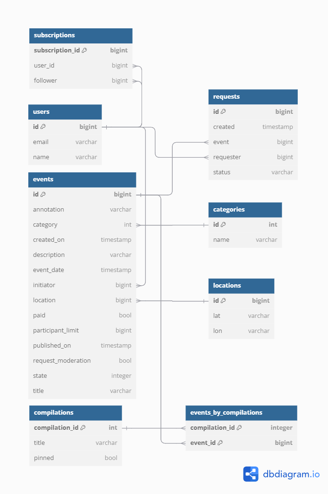

# Java explore with me.

## Описание
Backend часть приложения для формирования афиши событий
и поиска друзей для совместного посещения мероприятий

Проект разделен на несколько модулей, поддерживая микросервисную архитектуру:
1. Сервер основного приложения, обеспечивающего основной функционал.
2. Сервер статистики, хранящий в себе информацию необходимую для анализа и формирования просмотров записей
3. Отдельный модуль для хранения шаблонных DTO
4. Http клиент

Для взаимодействия модулей по REST API реализован HTTP-client с помощью RestTemplate.

## Технологии и инструменты
* Java core
* Spring Boot + SpringJpa, Hibernate
* Maven - управление зависимостями, многомодульность
* Docker - развертывание и контейнеризация
* Mokito, junit 5 - тестирование
* СУБД - postgresSQL, H2 
* Lombok
* RestTemplate

## Цель
Учебный проект, направленный на освоение использованных технологий

## Функционал
Публичный API приложения позволяет не авторизованным пользователям искать события по фильтрам, просматривать
события, просматривать категории, получать подборки событий, используя фильтрацию.

Приватный API дает возможность авторизованным пользователям создавать / обновлять события,
просматривать свои события, просматривать и принимать заявки на участие. Также, авторизованные пользователи могут
создавать заявки на участие в чужих событиях.
Также, реализован функционал подписок на других пользователей, с возможностью просмотра их событий

API для администрирования определяет управление пользователями, подборками и категориями.

## Запуск

## ER - diagram
Сервер главного приложения:

Сервер статистики:

## Спецификация API
[Главный сервер](https://github.com/SergeyIv24/java-explore-with-me/blob/main/ewm-main-service-spec.json)

[Сервер статистики](https://github.com/SergeyIv24/java-explore-with-me/blob/main/ewm-stats-service-spec.json)

## Тестирование API с помощью Postman коллекции

[Коллекция для тестирования главного сервера]()

[Коллекция для тестирования подписок](https://github.com/SergeyIv24/java-explore-with-me/blob/feature_subscriptions/postman/feature.json)

[Коллекция для тестирования сервера статистики]()

