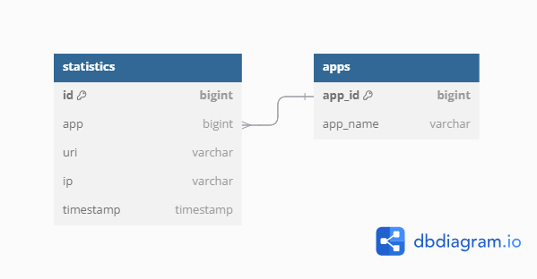

# Java explore with me.

## Описание
Backend часть приложения для формирования афиши событий и поиска друзей для совместного посещения мероприятий

Проект разделен на четыре модуля, поддерживая микросервисную архитектуру:
1. Сервер основного приложения, предоставляющего главный функционал.
2. Сервер статистики, хранящий в себе информацию необходимую для анализа и формирования просмотров событий
3. Отдельный модуль для хранения шаблонных DTO (Data transfer object)
4. Http клиент

Для взаимодействия модулей по REST API реализован HTTP-client с помощью RestTemplate.

## Технологии и инструменты
* Java core
* SpringBoot + SpringJpa + Hibernate
* Maven - управление зависимостями, многомодульность
* Docker - развертывание и контейнеризация
* Mokito, junit 5 - тестирование
* СУБД - postgresSQL, H2 
* Lombok
* RestTemplate

## Цель
Учебный проект, направленный на освоение использованных технологий

## Функционал
Публичный API приложения позволяет не авторизованным пользователям искать события по фильтрам, просматривать события,
просматривать категории, получать подборки событий, используя фильтрацию и сортировку.

Приватный API дает возможность авторизованным пользователям создавать или обновлять события,
просматривать пользовательские события, просматривать и принимать заявки на участие.
Также, авторизованные пользователи могут
создавать заявки на участие в чужих событиях.
Также, реализован функционал подписок на других пользователей, с возможностью просмотра их событий.

API для администрирования определяет управление пользователями, подборками и категориями.

## Запуск
1. Клонировать репозиторий: git clone https://github.com/SergeyIv24/java-explore-with-me.git
2. Перейти в папку с проектом cd java-explore-with-me
3. Запуск: docker compose up -d

## ER - diagram
Сервер главного приложения:

Сервер статистики:

## Спецификация API
[Главный сервер](https://github.com/SergeyIv24/java-explore-with-me/blob/main/ewm-main-service-spec.json)

[Сервер статистики](https://github.com/SergeyIv24/java-explore-with-me/blob/main/ewm-stats-service-spec.json)

## Тестирование API с помощью Postman коллекции

[Коллекция для тестирования главного сервера](https://github.com/SergeyIv24/java-explore-with-me/blob/main/postman/ewm-main-service.json)

[Коллекция для тестирования подписок](https://github.com/SergeyIv24/java-explore-with-me/blob/feature_subscriptions/postman/feature.json)

[Коллекция для тестирования сервера статистики](https://github.com/SergeyIv24/java-explore-with-me/blob/main/postman/ewm-stat-service.json)

